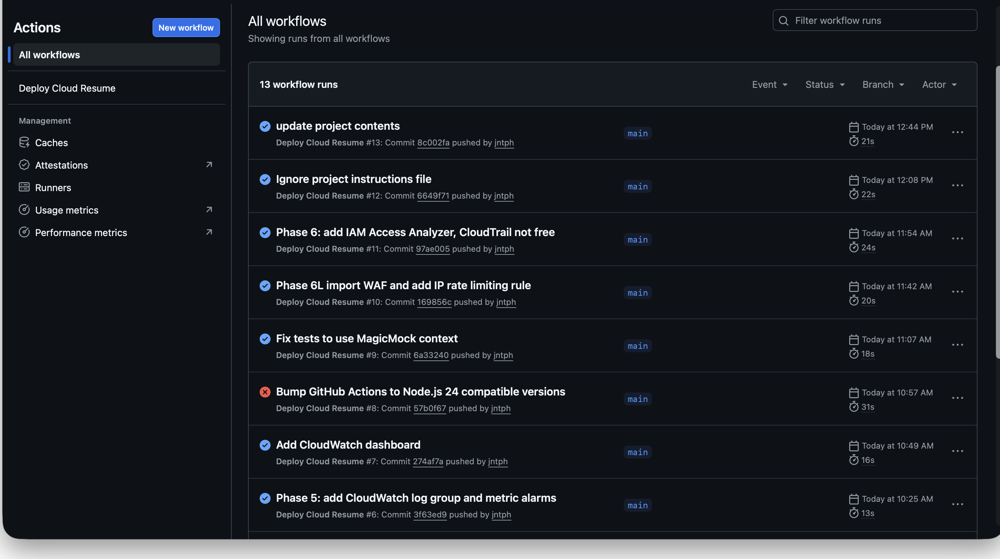
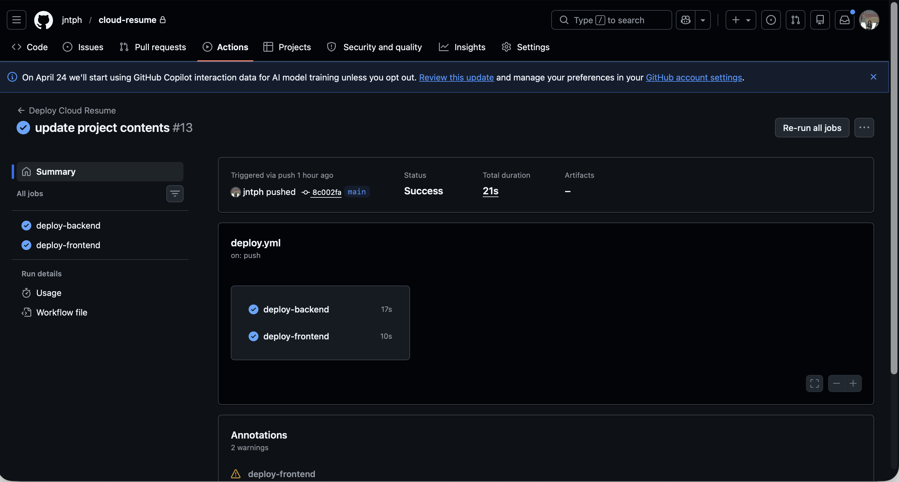
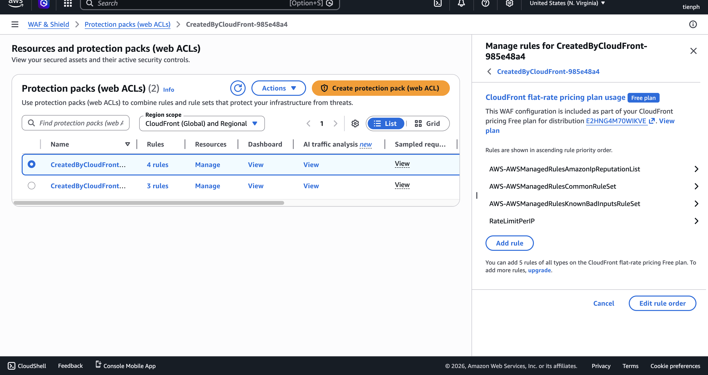
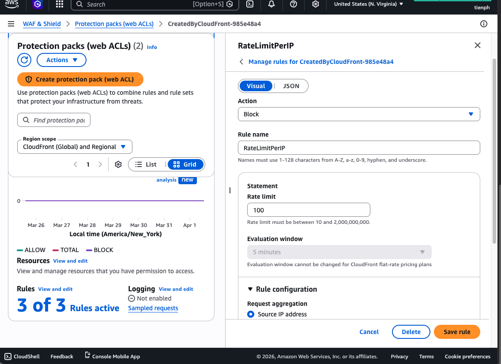
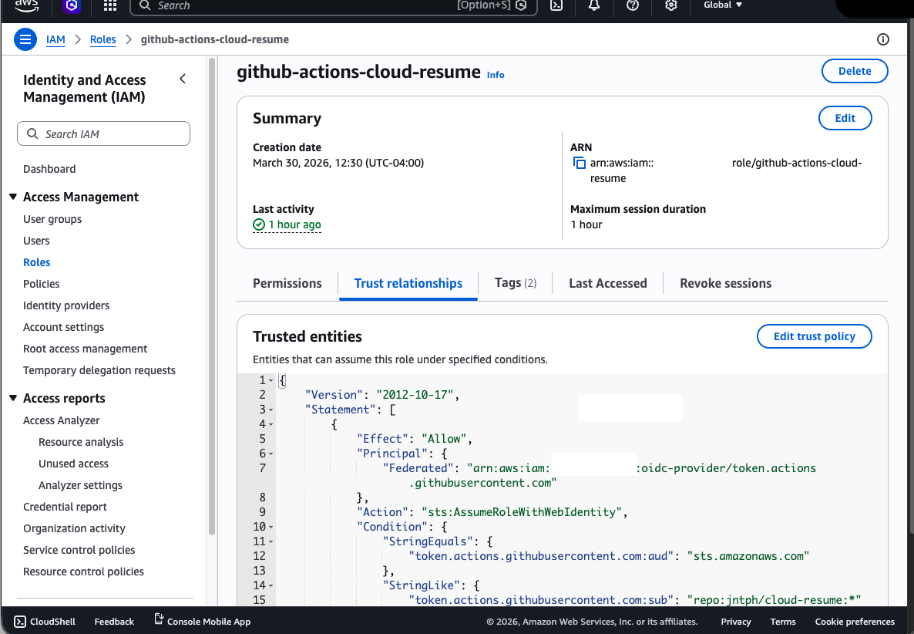
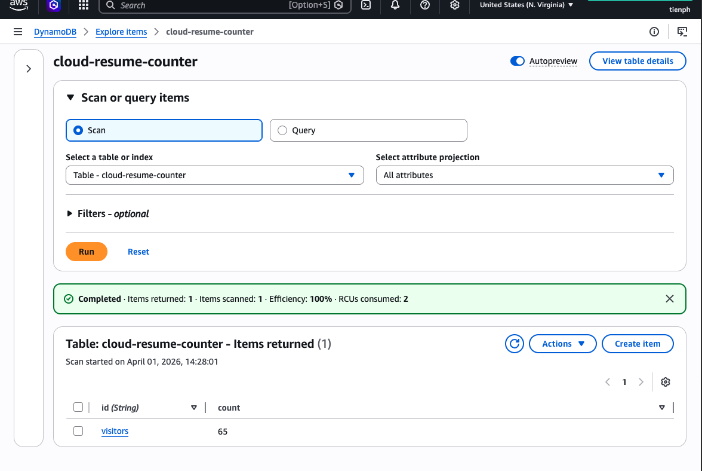
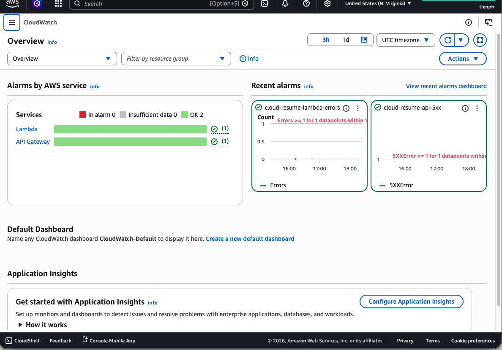

# Cloud Resume Challenge

A production-grade serverless resume website on AWS — built to demonstrate that I can design, deploy, secure, and operate real cloud infrastructure, not just pass a certification exam.

**Live site:** [jannatp.com](https://jannatp.com)

---

## Architecture

```
Browser → Route 53 → CloudFront (WAF) → S3 (static site)
                                      ↓
                              API Gateway → Lambda (Python) → DynamoDB
```

- **Frontend:** Static HTML/CSS/JS served from S3, distributed globally via CloudFront with a custom domain and TLS 1.2+ certificate from ACM
- **Backend:** Visitor counter via API Gateway → Lambda (Python) → DynamoDB
- **Infrastructure:** All resources provisioned with Terraform; remote state stored in S3
- **CI/CD:** GitHub Actions deploys on every push to `main` using OIDC federation — no IAM access keys stored anywhere
- **Security:** WAF with IP rate limiting + AWS managed rule groups, least-privilege IAM, IAM Access Analyzer
- **Observability:** CloudWatch structured logging, Lambda and API Gateway 5xx alarms

---

## Project Phases

| Phase | What I built |
|-------|--------------|
| 1 | S3 static site + CloudFront + ACM certificate + Route 53 DNS |
| 2 | Visitor counter: API Gateway + Lambda (Python) + DynamoDB |
| 3 | All infrastructure migrated to Terraform with S3 remote state |
| 4 | GitHub Actions CI/CD with OIDC auth (no IAM access keys) |
| 5 | CloudWatch structured logging + Lambda/API 5xx alarms |
| 6 | WAF rate limiting (100 req/5 min) + IAM Access Analyzer |

---

## Key Technical Decisions

**OIDC over IAM keys** — GitHub Actions authenticates via OpenID Connect federation. The IAM role's trust policy is scoped to this specific repo, so no long-lived credentials are ever stored in GitHub Secrets or anywhere else.

**Terraform from day one** — all infrastructure is defined as code and fully reproducible. This includes the CloudFront distribution, WAF Web ACL, DynamoDB table, Lambda function, and IAM roles.

**WAF at the edge** — IP-based rate limiting blocks abusive traffic at CloudFront before it reaches the origin, alongside AWS managed rule groups covering IP reputation, common attack patterns, and known bad inputs.

---

## Screenshots

### CloudFront Distribution — custom domain + HTTPS


### GitHub Actions — CI/CD Pipeline



### WAF Web ACL — managed rules + rate limiting



### IAM Role — OIDC Trust Policy (no static keys)


### DynamoDB — Visitor Counter


### CloudWatch — Alarms


---

## Tech Stack

| Category | Tools |
|----------|-------|
| Cloud | AWS (S3, CloudFront, ACM, Route 53, Lambda, API Gateway, DynamoDB, WAF, IAM, CloudWatch) |
| IaC | Terraform |
| CI/CD | GitHub Actions + OIDC |
| Language | Python (Lambda), HTML/CSS/JS (frontend) |
| Security | WAF, IAM Access Analyzer, least-privilege IAM |
